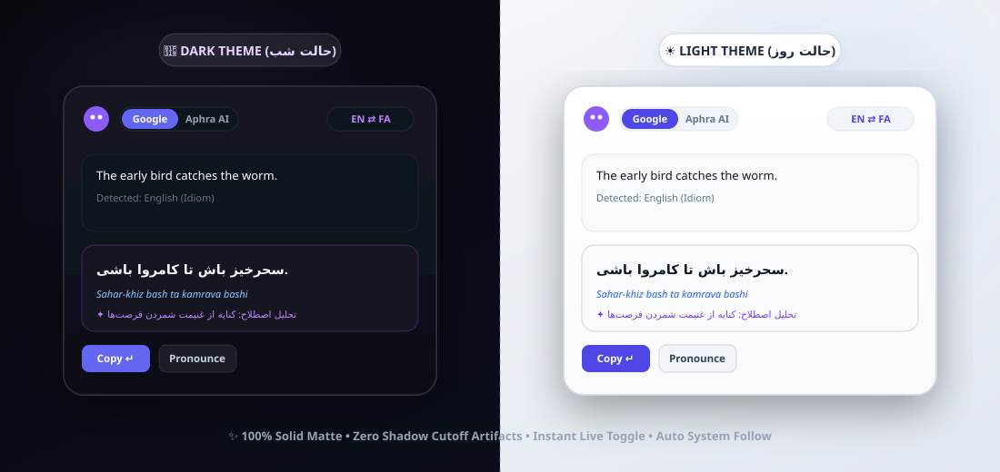

<div align="center" dir="rtl">

# 🏝️ Arizo Translate (آریزو ترنسلیت)
### دستیار هوشمند ترجمه داینامیک آیلند برای ویندوز ۱۰ و ۱۱

[](#)
[](README.md)
[](https://github.com/ArizoOwner/arizo-translate/releases)
[](https://www.electronjs.org/)
[](https://nodejs.org/)
[](LICENSE)
[](https://github.com/ArizoOwner/arizo-translate/releases)

<p align="center">
  <b>یک ابزار فوق‌العاده سریع، مینیمال و هوشمند برای ترجمه دوطرفه انگلیسی و فارسی بدون خروج از محیط کار</b><br/>
  <i>دارای رابط کاربری داینامیک آیلند معلق، کاراکتر کارتونی موچی با ردیابی موس، ترجمه درجا در تمام برنامه‌ها و دو موتور هوش مصنوعی.</i>
</p>

<!-- نوار تغییر زبان -->
<p align="center">
  <b>🌐 انتخاب زبان مستندات:</b> 
  <a href="README.fa.md"><b>فارسی (Persian)</b></a> • 
  <a href="README.md"><b>English (انگلیسی)</b></a>
</p>

<!-- تصویر بنر هدر -->
<p align="center">
  
</p>

[✨ قابلیت‌های کلیدی](#-قابلیت‌های-کلیدی) • [🤖 کاراکتر تعاملی موچی](#-کاراکتر-کارتونی-تعاملی-mochi) • [🌓 تم روز و شب](#-تم‌های-کنتراست-بالا-شب-و-روز-dark--light) • [📥 دانلود فایل‌ها](#-دانلود-نسخه‌های-آماده-ویندوز) • [⌨️ کلیدهای میانبر](#️-کلیدهای-میانبر-سراسری) • [🛠️ راهنمای توسعه](#️-راهنمای-توسعه-و-کامپایل)

---

</div>

<br/>

<!-- تصویر ۳ حالت تعاملی -->
<p align="center">
  
</p>

---

## 💡 چرا آریزو ترنسلیت؟ (فلسفه ساخت)

جابجایی مکرر بین تب‌های مرورگر، گوگل ترنسلیت و برنامه‌های مختلف در ویندوز باعث قطع تمرکز ذهنی، کاهش بازدهی کاری و خستگی کاربر می‌شود.

**Arizo Translate** این دغدغه را به‌صورت ریشه‌ای در ویندوز برطرف کرده است. این برنامه با الهام از ایده **Dynamic Island**، به‌صورت یک جزیره معلق و شیک در بالای صفحه نمایش شناور است، هرگز فوکوس فعال پنجره‌های شما را سلب نمی‌کند و با یک میانبر ساده یا راست‌کلیک، متن را در همان جایی که مشغول کار هستید ترجمه یا جایگزین می‌کند.

---

## ✨ قابلیت‌های کلیدی

### 🏝️ ۱. جزیره پویای معلق (Dynamic Island)
- **حذف کامل سایه مستطیل‌شکل در ویندوز:** با بهره‌گیری از تنظیمات اختصاصی DWM ویندوز (`thickFrame: false` و `hasShadow: false`)، هرگونه سایه مستطیلی نامناسب و بریدگی‌های کادر در ویندوز ۱۰ و ۱۱ کاملاً برطرف شده است.
- **بک‌گراند مات و یکدست (Solid Matte):** بدون ترنسپرنسی آزاردهنده و شفافیت ناخواسته، به‌طوری که برنامه‌های در حال اجرای پشت جزیره اصلاً پیدا نیستند.
- **انیمیشن‌های نرم و الاستیک:** جابجایی روان بین حالت کپسول فشرده (`Ctrl + M`) و حالت کامل جزیره.

### ⚡ ۲. ترجمه جادویی درجا در هر برنامه (`Alt + Shift + D`)
- در فیلد چت **تلگرام، دیسکورد، واتساپ، نرم‌افزار Word، فرم‌های مرورگر یا ویرایشگرهای کد** متن خود را بنویسید و کلید **`Alt + Shift + D`** را فشار دهید.
- دستیار بدون باز کردن هیچ پنجره‌ای، متن را خوانده، به فارسی یا انگلیسی روان ترجمه کرده و فوراً در همان فیلد تایپ جایگزین می‌نماید!

### 🎯 ۳. دکمه شناور با راست‌کلیک (Floating Bubble)
- متنی را در هر کجای ویندوز با موس هایلایت کنید و راست‌کلیک نمایید؛ یک حباب شیک و کوچک کنار نشانگر موس ظاهر می‌شود که با زدن روی آن ترجمه کامل پدیدار می‌گردد.
- **عدم نمایش بی‌مورد:** این دکمه **تنها زمانی ظاهر می‌شود که واقعاً متنی با موس انتخاب شده باشد**. کلیک راست عادی روی دسکتاپ یا منوها هیچ مزاحمتی ایجاد نخواهد کرد.
- **حفظ حریم کلیپ‌بورد:** مکانیزم ایزولاسیون سنتیل تضمین می‌کند محتوای حافظه کلیپ‌بورد اصلی شما هرگز آسیب ندیده یا متن‌های موقت روی آن بازنویسی نشود.

### 🤖 ۴. کاراکتر کارتونی تعاملی (Mochi)
<div align="center">
  <a href="docs/assets/mascot-interactive.html" target="_blank">
    
  </a>
  <p><i>موچی نفس می‌کشد، پلک می‌زند و به اطراف نگاه می‌کند! <a href="docs/assets/mascot-interactive.html">👉 مشاهده دموی تعاملی وب با ردیابی زنده موس</a></i></p>
</div>

- یک همراه کارتونی دوست‌داشتنی و برداری در گوشه داینامیک آیلند.
- جهت نگاه چشمان و فیزیک بدن موچی به‌صورت زنده با حرکت موس کاربر در سراسر مانیتور تعامل دارد.
- با کپی کردن ترجمه یا تمیزکاری متن، موچی لبخند زده و جشن می‌گیرد!

---

## 🌓 تم‌های کنتراست بالا شب و روز (Dark & Light)

امکان انتخاب بین **حالت تیره (Dark)**، **حالت روشن (Light)** و **پیروی خودکار از ویندوز (System Default)** بدون هرگونه تداخل رنگی:

<p align="center">
  
</p>

- **🌙 تم تاریک (پیش‌فرض):** مشکی مات لوکس (`#0c0e17`) با المان‌های بنفش نئونی و فونت‌های سفید بسیار خوانا.
- **☀️ تم روشن:** سفید و خاکستری مات مینیمال (`#ffffff` / `#f8fafc`) با متن‌های سورمه‌ای سیر (`#0f172a`) و کنتراست استاندارد بدون خستگی چشم.
- **💻 هماهنگ با سیستم:** تغییر خودکار تم با سوییچ تم شب/روز در تنظیمات ویندوز.

---

## 🌍 تغییر زبان کل پروژه در تنظیمات (Language Switcher)

امکان تغییر کامل زبان محیط کاربری برنامه:
- **فارسی:** چیدمان کامل راست‌به‌چپ (RTL) با فونت رسمی و چشم‌نواز وزیرمتن (Vazirmatn).
- **English:** چیدمان چپ‌به‌راست (LTR) با فونت مدرن Plus Jakarta Sans.
- تغییر آنی با پیش‌نمایش زنده در بخش **تنظیمات (`Ctrl + ,`)**.

---

## 🧠 موتور دوگانه ترجمه (Dual Engine)

| موتور | ویژگی‌ها | کاربرد اصلی |
| :--- | :--- | :--- |
| **⚡ گوگل آنی (Google Instant)** | سرعت کمتر از ۱۵۰ میلی‌ثانیه، کاملاً رایگان، بدون نیاز به کلید API یا پروکسی. | وب‌گردی روزمره، چت‌های سریع، متن‌های عمومی. |
| **✦ هوش مصنوعی آریزو (Aphra AI)** | تحلیل چندمرحله‌ای عامل‌محور، درک کنایه‌ها و اصطلاحات، قابلیت تنظیم لحن (رسمی، محاوره‌ای، ادبی، تخصصی). | مقالات، کنایه‌ها و اصطلاحات، کدهای برنامه‌نویسی، ایمیل‌های کاری. |

### ارائه‌دهندگان هوش مصنوعی پشتیبانی‌شده
- **Google Gemini** (`gemini-3.8-flash`, `gemini-2.5-flash`, `gemini-3.8-pro`)
- **DeepSeek** (`deepseek-chat`)
- **OpenRouter** (تمام مدل‌های مطرح روز)
- **Groq** (`llama-3.3-70b-versatile`, `llama-3.1-8b-instant`)
- **OpenAI** (`gpt-4o-mini`, `gpt-4o`)
- **Ollama / سرورهای محلی** (کاملاً آفلاین، محرمانه و بدون نیاز به کلید)

---

## ⌨️ کلیدهای میانبر سراسری

| کلید میانبر | عملکرد | توضیحات |
| :--- | :--- | :--- |
| **`Alt + D`** | **باز/بستن جزیره** | نمایش یا محو کردن پنجره داینامیک آیلند در هر کجای ویندوز |
| **`Alt + Shift + D`** | **ترجمه درجا** | ترجمه و جایگزینی فوری متن در تلگرام، ورد و فیلدهای تایپ |
| **`Ctrl + Tab`** | **تغییر موتور** | جابجایی بین حالت سریع گوگل و هوش مصنوعی آریزو |
| **`Ctrl + S`** | **معکوس زبان‌ها** | جابجایی زبان مبدا و مقصد (مثلاً انگلیسی ⇄ فارسی) |
| **`Ctrl + M`** | **حالت کپسول** | تبدیل جزیره به یک کپسول باریک و جمع‌وجور شناور |
| **`Enter`** | **کپی و بستن** | کپی متن ترجمه‌شده در کلیپ‌بورد و بستن نرم پنجره |
| **`Ctrl + Enter`** | **جایگزینی در برنامه** | پیست کردن خودکار ترجمه در برنامه فعال قبلی |
| **`Esc`** | **بستن پنجره** | انصراف یا بستن پنجره به Tray ویندوز |

---

## 📥 دانلود نسخه‌های آماده ویندوز

فایل‌های خروجی رسمی کامپایل‌شده از بخش [GitHub Releases](https://github.com/ArizoOwner/arizo-translate/releases) قابل دریافت است:

| نسخه | فرمت | نام فایل | توضیحات |
| :--- | :--- | :--- | :--- |
| **نصب‌کننده ویندوز** | نصبی NSIS | `Arizo-Translate-Setup-2.0.0.exe` | فایل نصب خودکار همراه با شورتکات دسکتاپ و استارت منو |
| **نسخه پرتابل** | پرتابل Portable | `Arizo-Translate-2.0.0-Portable.exe` | نسخه پرتابل و بدون نیاز به نصب (قابل اجرا از روی فلش) |

---

## 🛠️ راهنمای توسعه و کامپایل

### نیازمندی‌ها
- نود جی‌اس نسخه ۲۰.۰ به بالا (`Node.js >= 20.0`)
- سیستم‌عامل ویندوز ۱۰ یا ۱۱ نسخه ۶۴ بیتی

### ۱. دریافت مخزن
```bash
git clone https://github.com/ArizoOwner/arizo-translate.git
cd arizo-translate
```

### ۲. نصب بسته‌ها
```bash
npm install
```

### ۳. اجرای برنامه در حالت توسعه
```bash
npm start
```

### ۴. اجرای آزمون‌های خودکار
```bash
npm test
```

### ۵. ساخت فایل اجرایی نصبی و پرتابل
```bash
npm run dist
```
فایل‌های خروجی پس از پایان فرآیند کامپایل در پوشه `dist/` قرار می‌گیرند.

---

## 📄 مجوز و لایسنس

این پروژه تحت [مجوز MIT](LICENSE) منتشر شده است. ساخته شده با ❤️ توسط ArizoOwner.
