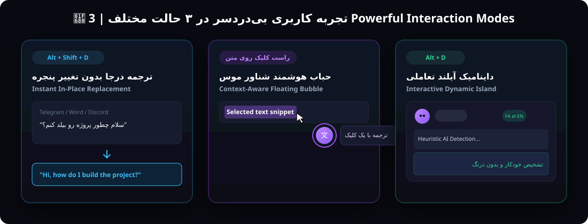

<div align="center">

# 🏝️ Arizo Translate (آریزو ترنسلیت)
### دستیار هوشمند ترجمه داینامیک آیلند برای ویندوز | Dynamic Island AI Translation Assistant for Windows

[](https://github.com/ArizoOwner/arizo-translate/releases)
[](https://www.electronjs.org/)
[](https://nodejs.org/)
[](LICENSE)
[](https://github.com/ArizoOwner/arizo-translate/releases)

<p align="center">
  <b>یک ابزار فوق‌العاده سریع، مینیمال و هوشمند برای ترجمه دوطرفه انگلیسی و فارسی بدون خروج از محیط کار</b><br/>
  <i>Ultra-fast, distraction-free, and intelligent bidirectional translation right on top of any Windows application.</i>
</p>

<!-- HERO SHOWCASE IMAGE -->
<p align="center">
  
</p>

[🇮🇷 راهنمای فارسی](#-راهنمای-فارسی) • [🇬🇧 English Guide](#-english-documentation) • [📥 دانلود فایل نصبی و پرتابل](#-دانلود-نسخه‌های-آماده-ویندوز--download-windows-releases) • [⌨️ کلیدهای میانبر](#️-کلیدهای-میانبر--shortcuts) • [🛠️ راهنمای توسعه](#️-راهنمای-توسعه-و-کامپایل--development--build)

---

</div>

<br/>

<!-- 3 MODES SHOWCASE IMAGE -->
<p align="center">
  
</p>

---

## 🇮🇷 راهنمای فارسی

### 💡 چرا آریزو ترنسلیت؟ (معرفی و فلسفه ساخت)
یکی از چالش‌های روزمره کاربران فارسی‌زبان در سیستم‌عامل ویندوز، برخورد دائمی با متون انگلیسی در مرورگرها، اسناد تخصصی، محیط‌های برنامه‌نویسی، تلگرام، دیسکورد و فایل‌های PDF است. رفت و آمد مکرر به تب‌های مرورگر یا برنامه‌های آنلاین ترجمه باعث اتلاف وقت، قطعی زنجیره تفکر و قطع تمرکز ذهنی می‌شود.

**Arizo Translate** با الهام از طراحی پیشرفته **Dynamic Island**، یک دستیار معلق، باوقار و بی‌نهایت سریع است که همیشه بالای صفحه نمایش بدون مزاحمت آماده به خدمت است و با یک میانبر یا یک کلیک راست، متن را در همان جایی که هستید برای شما ترجمه یا جایگزین می‌کند.

---

### ✨ قابلیت‌ها و ویژگی‌های کلیدی

#### 🏝️ ۱. جزیره پویای مدرن و معلق (Dynamic Island)
- **طراحی شیک و مات (Solid Matte Dark):** بدون محو شدن یا نمایان بودن پنجره‌های پشت سر، با پالت رنگی تیره لوکس و بنفش نئونی.
- **ریسپانسیو و بدون باگ در تغییر سایز:** چیدمان الاستیک و شناور بدون بیرون‌زدگی دکمه‌های بستن و مینیمایز حتی هنگام انتخاب لحن هوشمند.
- **همیشه در دسترس:** شناور روی تمامی برنامه‌ها (Always-on-top) بدون سلب کردن ناخواسته فوکوس پنجره فعال شما.

#### ⚡ ۲. ترجمه جادویی درجا در هر برنامه (`Alt + Shift + D`)
- در کادر چت تلگرام، دیسکورد، واتساپ، نرم‌افزار Word، فرم‌های وب یا ایمیل متن خود را تایپ کنید و کلید **`Alt + Shift + D`** را بزنید.
- دستیار بدون نیاز به هایلایت دستی، متن را شناسایی کرده، به زبان مقابل ترجمه می‌کند و بلافاصله در همان فیلد جایگزین می‌نماید!

#### 🎯 ۳. دکمه هوشمند شناور با کلیک راست (Smart Floating Bubble)
- متنی را در هر صفحه‌ای با موس هایلایت کنید و کلیک راست نمایید؛ یک حباب شیک و کوچک کنار نشانگر موس پدیدار می‌شود که با کلیک روی آن ترجمه کامل متن نمایش داده می‌شود.
- **فیلتر هوشمند تشخیص متن:** این دکمه **صرفاً زمانی ظاهر می‌شود که واقعاً متنی با موس انتخاب شده باشد**؛ کلیک راست عادی روی دسکتاپ یا برنامه‌ها بدون متن هرگز حباب مزاحمی باز نخواهد کرد.
- **ایزولاسیون کامل کلیپ‌بورد:** مکانیزم پیشرفته و غیرهمگام سنتیل جهت تضمین پاکیزگی دیتای کپی‌شده بدون نشت هیچ متن ناخواسته‌ای به حافظه موقت.

#### 🤖 ۴. کاراکتر تعاملی موچی (Interactive Mascot)
- یک کاراکتر انیمیشنی، دوست‌داشتنی و پویا در گوشه برنامه که جهت چشمان و فیزیک بدنش به صورت زنده با حرکت نشانگر موس کاربر تعامل دارد و حس زنده بودن به میز کار شما می‌بخشد.

#### 🔄 ۵. تشخیص هوشمند دوطرفه زبان (Smart Bidirectional Detection)
- تفکیک خودکار جملات فارسی از انگلیسی حتی در متون تخصصی ترکیبی (مثل جملات برنامه‌نویسی حاوی کلمات و توابع انگلیسی).
- سوییچ خودکار: فارسی ⇄ انگلیسی بدون نیاز به انتخاب دستی زبان مقصد.

#### 🧹 ۶. ابزار پاکسازی خطوط PDF (PDF Text Cleaner)
- متون کپی‌شده از فایل‌های PDF معمولاً با اینترهای اضافی و خطوط شکسته کپی می‌شوند. با دکمه اختصاصی **🧹 الحاق خطوط PDF** تمامی شکست‌ها و خط‌تیره‌های اضافی در کسری از ثانیه مرتب و ترجمه می‌شوند.

#### 🗣️ ۷. تلفظ صوتی طبیعی (Bilingual TTS)
- پشتیبانی از تلفظ صوتی شفاف و روان برای عبارات انگلیسی و فارسی.

#### 🧠 ۸. موتور دوگانه ترجمه (Dual Engine)
- **موتور سریع (Google Instant):** ترجمه در کسری از ثانیه (زیر ۱۵۰ میلی‌ثانیه) بدون نیاز به پروکسی، کلید API یا هزینه.
- **موتور هوش مصنوعی آریزو (Agentic AI Engine):** پایپ‌لاین پیشرفته چندمرحله‌ای برای درک کنایه‌ها، اصطلاحات عامیانه (Idioms & Slang Breakdown)، تنظیم لحن (رسمی، عامیانه، ادبی، تخصصی) با امکان اتصال به OpenRouter، DeepSeek، Groq، OpenAI و مدل‌های لوکال Ollama.

---

<br/>

## 🇬🇧 English Documentation

### 💡 Why Arizo Translate?
Switching back and forth between workspace windows, browser tabs, and translation websites causes constant cognitive friction and interrupts deep workflow. **Arizo Translate** solves this problem by bringing an ultra-fast, native Windows Dynamic Island assistant directly to your desktop.

It hovers elegantly at the top of your screen, captures text effortlessly across any Windows app, and translates or replaces text in-place with zero distraction.

---

### 🌟 Key Features

- 🏝️ **Floating Dynamic Island**: Solid dark finish with fluid CSS animations, high-precision geometry, and clean typography that never cuts off window controls.
- ⚡ **Instant In-Place Translation (`Alt + Shift + D`)**: Type in Telegram, Word, Discord, or web inputs, hit the hotkey, and watch your text instantly translate right inside the field!
- 🎯 **Context-Aware Floating Bubble**: Highlights text anywhere, right-clicks, and a sleek translation bubble appears right near the cursor. If no text is selected, it silently stays hidden with zero false triggers.
- 🔒 **Zero Clipboard Leak Guarantee**: Fully asynchronous clipboard management preventing sentinel strings or intermediate tokens from ever polluting your system clipboard.
- 🤖 **Interactive Mascot ("Mochi")**: Vector-shaded cartoon companion with real-time pupil and eye kinematics that follow your mouse cursor.
- 🔄 **Heuristic Bidirectional Detection**: Accurately distinguishes between Persian, English, and technical sentences mixed with programming identifiers.
- 🧹 **Smart PDF Line De-hyphenator**: Automatically merges broken paragraph lines and joins hyphenated words from copied PDF articles.
- 🗣️ **Natural Bilingual TTS**: Built-in audio speech synthesis for both Persian and English.
- ⚡ **Dual Engine Flexibility**: Instant ultra-fast translation (<150ms) plus advanced Agentic AI through OpenRouter, Groq, Ollama, or OpenAI.

---

## ⌨️ کلیدهای میانبر | Shortcuts

| کلید میانبر (Shortcut) | عملکرد در زبان فارسی | English Description |
|---|---|---|
| **`Alt + D`** | باز کردن جزیره پویا و ترجمه خودکار متن انتخاب‌شده | Open Dynamic Island & translate selected text |
| **`Alt + Shift + D`** | **ترجمه آنی درجا در فیلد فعال برنامه مبدا (تلگرام، ورد،...)** | **Instant in-place translation in active input field** |
| **`Enter`** | کپی ترجمه در کلیپ‌بورد و جمع شدن پنجره | Copy translation to clipboard and collapse island |
| **`Ctrl + Enter`** | جایگزینی درجا ترجمه در برنامه باز | Replace translated text in current active application |
| **`Ctrl + Shift + C`** | کپی دوزبانه (متن اصلی + متن ترجمه) | Bilingual copy (Source + Target translation) |
| **`Esc`** | بستن یا جمع کردن جزیره ترجمه | Hide or collapse the Dynamic Island |
| **`Ctrl + Tab`** | سوییچ سریع بین موتور سریع و موتور هوشمند | Toggle between Fast and Smart engine |

---

## 📥 دانلود نسخه‌های آماده ویندوز | Download Windows Releases

تمامی نسخه‌ها از پیش کامپایل شده و آماده اجرا در ویندوز ۱۰ و ۱۱ هستند:  
Direct downloads available on [GitHub Releases v2.0.0](https://github.com/ArizoOwner/arizo-translate/releases/tag/v2.0.0):

| نوع فایل (Package Type) | نام فایل دانلودی (File Name) | توضیحات (Description) |
|---|---|---|
| 📦 **فایل نصبی (Installer)** | [**`Arizo.Translate.Setup.2.0.0.exe`**](https://github.com/ArizoOwner/arizo-translate/releases/download/v2.0.0/Arizo.Translate.Setup.2.0.0.exe) | فایل نصب رسمی ویندوز با ساخت آیکون دسکتاپ و استارت‌منو |
| 🚀 **نسخه پرتابل (Portable)** | [**`Arizo.Translate-Portable-2.0.0.exe`**](https://github.com/ArizoOwner/arizo-translate/releases/download/v2.0.0/Arizo.Translate-Portable-2.0.0.exe) | اجرای فوری بدون نیاز به نصب یا دسترسی Administrator |

---

## 🛠️ راهنمای توسعه و کامپایل | Development & Build

برای اجرای پروژه در محیط توسعه و ساخت فایل نصبی:

```bash
# ۱. دریافت ریپازیتوری
git clone https://github.com/ArizoOwner/arizo-translate.git
cd arizo-translate

# ۲. نصب وابستگی‌ها
npm install

# ۳. اجرای برنامه در حالت توسعه
npm start

# ۴. اجرای تست‌های نرم‌افزاری
npm test

# ۵. ساخت فایل نصبی و پرتابل ویندوز (Build .exe)
npm run dist
```

فایل‌های خروجی در پوشه `dist/` با نام‌های `Arizo Translate Setup 2.0.0.exe` و `Arizo Translate-Portable-2.0.0.exe` ایجاد خواهند شد.

---

## 📄 لایسنس | License

این پروژه تحت مجوز [MIT License](LICENSE) منتشر شده است.
Developed with ❤️ by ArizoOwner.
